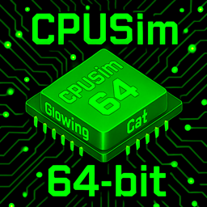

# CPUSim64

*A 64-bit virtual CPU, assembler, and simulation environment*

©2026 Richard Lesh.  All rights reserved.

CPUSim64 is a complete software toolchain for experimenting with CPU architecture and assembly language design.  

It includes:

- A 64-bit virtual CPU with a simple instruction set  
- A Java-based assembler built using ANTLR4 grammars  
- A cycle-accurate simulation engine  
- A simple IDE with code editor, console, and integrated run/debug  
- A native CLI tool for command-line workflows  
- An agentic AI assistant with RAG-based context retrieval for writing and debugging assembly code  
- Native installers for macOS, Windows, and Linux (x64 and ARM64)  
- A multi-module Maven build system producing runnable JAR files

The project is designed for educational use, computer architecture instruction, and experimentation with ISA design and microarchitecture concepts.

---

## 🚀 Features

### **Integrated Development Environment**
- Code editor with syntax highlighting for CPUSim64 assembly
- Line number margin  
- Custom terminal console with ANSI terminal support and fast rendering  
  - ANSI foreground and background colors (standard and bright)
  - Carriage return (`\r`) support for progress bars and spinners  
  - Cursor hide/show escape sequences  
  - Full ANSI SGR support: bold, dim, italic, underline, blink, reverse, hidden, strikethrough  
  - Clear to end of line and clear line escape sequences  
- Assemble, Run, Debug, and Trace from the menu  
- Run/Stop toggle button — Stop terminates the running program and all child processes  
- Ctrl+C to interrupt running program, Ctrl+D to signal EOF  
- Configurable Heap Size (MiB) and Stack Size (kiB) in the toolbar  
- Find and Replace with regex/grep support and capture groups  
- Shift Selection Left/Right (Cmd+[/]) for block indent/dedent  
- Cmd+click (macOS) / Ctrl+click to navigate `#include` files  
- System include files open in a read-only viewer  
- Configurable fonts, sizes, and syntax highlighting colors  
- Settings persisted to `~/.cpusim64-settings.json`  
- Tab key inserts spaces to 4-character tab stops  
- Smart backspace: deletes to previous tab stop in leading whitespace  
- Tabs converted to spaces on file open  
- Triple-click-drag selects whole lines  
- Undo/Redo support (text-snapshot based)  
- File Open/Save remembers last used directory  
- Splash screen and license key system  

### **Virtual CPU**
- Custom 64-bit RISC-style architecture  
- Support for integer/float arithmetic, branching, memory operations, and pseudo-instructions  
- Configurable registers, memory size, and device interfaces  

### **Assembler**
- Implemented in Java with **ANTLR4** lexer and parser  
- Strict syntax checking and helpful diagnostics  
- Support for labels, immediates, directives, and constants  
- Preprocessor with `#include`, `#define`, `#if`/`#else`/`#endif`, loops, macros, and functions  
- Emits gzip-compressed `.o64` object files

### **Simulation Engine**
- Cycle-accurate execution  
- Debug mode with stepping and register inspection  
- Trace mode for instruction-by-instruction tracing  
- Disassemble feature to disassemble object files

### **Symbolic Debugger**
- Integrated GUI debugger launched from the IDE  
- Disassembly view with live instruction markers and label annotations  
- Bidirectional breakpoint synchronization between source code and disassembly  
- Breakpoints on preprocessor directives (`#call`, `#macro`, etc.) map to generated instructions  
- Step Into, Step Over, Step Out, and Resume execution controls  
- Green execution line indicator in the source editor (coexists with breakpoints and line numbers)  
- Live register display with click-to-toggle decimal/hexadecimal values  
- Stack display with high-to-low address ordering and click-to-cycle decimal/hex/float values  
- Source-map-based address resolution (`.srcmap` file emitted during assembly)  
- Window layout (size, dividers, column widths) persisted across sessions  
- Source editor auto-scrolls to current execution line  
- Program I/O redirected to the IDE console pane during debugging  
- Memory window: right-click a register to inspect memory at that address  
- Memory window click-to-cycle value format: decimal, hex, float, Unicode character  
- Memory window right-click menu with String viewer and pointer-follow (Memory)  
- Heap block header highlighting (gray=allocated, green=free)  
- Status register (SR) display with PZSO flag indicators  

### **Agentic AI Assistant**
- Built-in AI chat panel in the IDE for writing and debugging CPUSim64 assembly  
- Supports multiple LLM vendors: OpenAI, Anthropic, Google, DeepSeek, Alibaba, and local Ollama  
- Generic OpenAI-compatible API vendor support via YAML configuration  
- Configurable model and API key via dedicated AI Chat Settings dialog  
- RAG-based context retrieval using embedding search or BM25 keyword fallback  
- Embedding and keyword index caching in `~/.cpusim64/`  
- Context-aware: automatically provides current source code and console output to the AI  
- AI responses with code blocks present Allow/Reject buttons for applying changes directly to the editor  
- Auto-apply fulltext code blocks for seamless code replacement  
- DiffApplier with regex-based hunk parsing and freeform diff support  
- Animated "thinking" indicator with cancel support  
- Markdown rendering in responses with bold, italic, code spans, and LaTeX math  
- Conversation history maintained across messages within a session  
- System prompt includes full CPUSim64 documentation, examples, and projects for accurate assistance  
- Clear button to reset conversation  
- Status bar showing system prompt, program, and output sizes  
- Separate AI font settings (sans-serif default) with code font for code blocks  
- Markdown table rendering in monospace for column alignment  
- Configurable chat text colors  
- Developer mode with prompt/response logging  

### **CLI Tool (`cpusim64`)**
- Native C++ command-line interface  
- Commands: `assemble`, `run`, `debug`, `trace`, `disassemble`, `preprocess`  
- Installable via the IDE's CLI Tools menu  

### **Native Installers**
- macOS DMG (signed and notarized) — ARM64  
- Windows MSI (Azure code signed) — x64 and ARM64  
- Linux DEB and RPM — x64 and ARM64  
- File type associations for `.asm`, `.o64`, `.sym`, `.sym1`, `.sym2`, `.srcmap`, and `.def` files  
- Built via GitHub Actions workflows

---

## 📦 Project Structure (CPUSim64V2)

The project uses a multi-module Maven layout separating the AI chat library, simulator/assembler core, and IDE.

```
CPUSim64V2/
├── LICENSE
├── NOTICE
├── README.md
├── pom.xml                          (parent POM)
│
├── aichat/                          (AI Chat Module)
│   ├── pom.xml
│   └── src/main/java/com/glowingcat/aichat/
│       ├── AIChatPanel.java
│       ├── DocumentRetriever.java   (RAG retrieval)
│       ├── EmbeddingClient.java
│       ├── KeywordIndex.java
│       ├── LLMClientFactory.java
│       ├── VendorRegistry.java
│       └── ...
│
├── cpusim64/                        (Simulator Module)
│   ├── pom.xml
│   ├── src/main/antlr4/            (ANTLR grammars)
│   ├── src/main/cpp/               (CLI tool source)
│   ├── src/main/java/cloud/lesh/CPUSim64/
│   │   ├── Assembler.java
│   │   ├── Simulator.java
│   │   ├── Preprocessor.java
│   │   └── ...
│   ├── src/main/resources/
│   │   ├── documentation/
│   │   ├── system/                  (system libraries)
│   │   └── adt/                     (data structure libraries)
│   ├── src/test/
│   └── validation/
│
├── ide/                             (IDE Module)
│   ├── pom.xml
│   └── src/main/java/com/glowingcat/cpusim64ide/
│       ├── IDEApp.java
│       ├── EditorPanel.java
│       ├── DebuggerWindow.java
│       ├── TerminalPanel.java
│       └── ...
│
├── resources/                       (jpackage resources)
│   ├── entitlements.plist
│   ├── macos/
│   └── linux/
│
├── .github/workflows/
│   ├── package.yml                  (native installer builds)
│   └── release.yml
│
└── *.sh / *.bat                     (convenience scripts)
```

---

### Module Overview

| Module     | Artifact                | Description                                              |
|------------|-------------------------|----------------------------------------------------------|
| `aichat`   | `org.lesh:aichat`       | Reusable AI chat panel with LLM integration and RAG      |
| `cpusim64` | `org.lesh:CPUSim64`     | Assembler, simulator, CLI tool, ANTLR grammars           |
| `ide`      | `org.lesh:CPUSim64IDE`  | JavaFX/Swing GUI IDE, depends on both modules above      |

---

## 🛠 Building

### Prerequisites
- JDK 21+
- Maven 3.9+

### Build
```bash
mvn clean package
```

### Build for release (JavaFX provided by runtime):
```bash
mvn clean package -P release -DskipTests=true
```

### Run the IDE locally:
```bash
./ide.sh
```

---

## 📚 Documentation

HTML reference documentation for the CPUSim64 architecture, instruction set, directives, interrupts, libraries, and programming model is bundled in `cpusim64/src/main/resources/documentation/`.

Online hosted documentation: http://cpusim64.lesh.cloud/

---

## License

GNU General Public License v3.0 — see [LICENSE](LICENSE) for details.

© 2026 Richard Lesh
